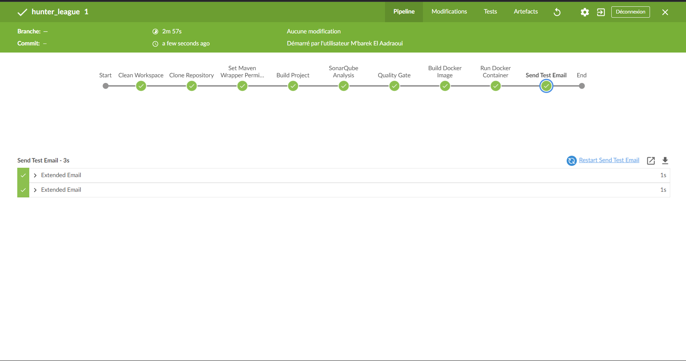

# CI/CD Pipeline Documentation for Java Spring Boot Project


## Overview
This document outlines the steps and configurations required to set up a CI/CD pipeline for a Java Spring Boot project using Jenkins. The pipeline includes code retrieval, build, code quality analysis, testing, containerization, deployment, and notifications.

---

## Objectives

1. Configure a Jenkins server for automating the CI/CD process.
2. Implement a Jenkins pipeline to:
   - Retrieve source code from Git.
   - Compile and build the project.
   - Perform code quality analysis using SonarQube.
   - Run unit tests with JUnit and ensure code coverage using Jacoco.
   - Deploy the project in a Docker container.
   - Enable manual approval for deployment to production.
   - Configure notifications for build and test results.
3. Document the entire process and configurations.

---

## Prerequisites

- **Jenkins Server** installed and running.
- **Docker** installed on the server.
- **SonarQube** server configured.
- **Git** installed and repository access.
- **JUnit** and **Jacoco** configured in the Spring Boot project.
- SMTP server credentials for email notifications.

---

## Jenkins Setup and Configuration

### Step 1: Create a Jenkins Docker Container
1. Pull the Jenkins Docker image:
   ```bash
   docker pull jenkins/jenkins:lts
   ```
2. Run the Jenkins container from docker compose:
   ```bash
   version: '3.8'
   services:
     jinkis:
       image: jenkins/jenkins:lts
       container_name: jinkis
       restart: unless-stopped
       user: root
       networks:
         - shared-network
       ports:
         - "8082:8080"
         - "50000:50000" # Pour la communication avec les agents Jenkins
       volumes:
         - C:\Users\Youcode\jinkis_home1:/var/jenkins_home
         - /var/run/docker.sock:/var/run/docker.sock # Partager le socket Docker de l'hôte
   
   networks:
     shared-network:
       external: true
   ```
   ### install docker inside jenkis container
   ```bash
        apt-get update

        apt-get install -y apt-transport-https ca-certificates curl software-properties-common gnupg
      
        curl -fsSL https://download.docker.com/linux/debian/gpg | gpg --dearmor -o /usr/share/keyrings/docker-archive-keyring.gpg
      
        echo "deb [arch=amd64 signed-by=/usr/share/keyrings/docker-archive-keyring.gpg] https://download.docker.com/linux/debian $(lsb_release -cs) stable" | tee /etc/apt/sources.list.d/docker.list > /dev/null
   
        apt-get update
      
        apt-get install -y docker-ce docker-ce-cli containerd.io
   ```
4. Access Jenkins at `http://<server-ip>:8080` and complete the setup wizard.

### Step 2: Install Required Plugins
- Install the following plugins:
  - **Pipeline**
  - **Git**
  - **Email Extension Plugin**
  - **SonarQube Scanner**
  - **Jacoco Plugin**
  - **Blue ocean**

---

## Jenkins Pipeline Configuration
### add credentials ;
Go to Jenkins Dashboard > **Administer Jenkins** > **Credentials** > **Global** > add github,docer,sonarqube and gmail Credentials.

### Step 1: Create a New Pipeline
1. Go to Jenkins Dashboard > **New Item** > **Pipeline**.
2. Configure the pipeline with the following script:

```groovy
pipeline {
    agent any
    stages {
        stage('Clean Workspace') {
            steps {
                cleanWs()
            }
        }
        stage('Clone Repository') {
            steps {
                git branch: 'main', url: 'https://github.com/your-repo/spring-boot-project.git'
            }
        }
        stage('Set Maven Wrapper Permissions') {
            steps {
                sh 'chmod +x ./mvnw'
            }
        }
        stage('Build Project') {
            steps {
                sh './mvnw clean package -DskipTests'
            }
        }
        stage('Run Unit Tests and Generate Coverage') {
            steps {
                sh './mvnw test'
            }
        }
        stage('SonarQube Analysis') {
            steps {
                withSonarQubeEnv('SonarQube') {
                    sh './mvnw sonar:sonar -Dsonar.host.url=http://sonarqube:9000'
                }
            }
        }
        stage('Build Docker Image') {
            steps {
                sh 'docker build -t springboot-app:latest .'
            }
        }
        stage('Manual Approval') {
            steps {
                input message: 'Approve Deployment?'
            }
        }
        stage('Deploy to Docker Container') {
            steps {
                script {
                    sh '''
                    if [ $(docker ps -q -f name=springboot-container) ]; then
                        docker stop springboot-container
                        docker rm springboot-container
                    fi
                    docker run -d --name springboot-container -p 8080:8080 springboot-app:latest
                    '''
                }
            }
        }
    }
    post {
        success {
            emailext(
                subject: "Pipeline Success: ${env.JOB_NAME} #${env.BUILD_NUMBER}",
                body: """
                <h3>Pipeline Passed</h3>
                <p>Job: ${env.JOB_NAME}</p>
                <p>Build Number: ${env.BUILD_NUMBER}</p>
                <p>URL: <a href='${env.BUILD_URL}'>Build Details</a></p>
                """,
                mimeType: 'text/html',
                to: 'developer@example.com'
            )
        }
        failure {
            emailext(
                subject: "Pipeline Failed: ${env.JOB_NAME} #${env.BUILD_NUMBER}",
                body: """
                <h3>Pipeline Failed</h3>
                <p>Job: ${env.JOB_NAME}</p>
                <p>Build Number: ${env.BUILD_NUMBER}</p>
                <p>URL: <a href='${env.BUILD_URL}'>Build Details</a></p>
                """,
                mimeType: 'text/html',
                to: 'developer@example.com'
            )
        }
    }
}
```

---

## Notifications Configuration

### Step 1: Configure Email Notifications
1. Go to **Manage Jenkins** > **Configure System**.
2. Scroll to the **Extended Email Notification** section and configure:
   - **SMTP Server**: `smtp.gmail.com`
   - **SMTP Port**: `587`
   - **Authentication**: Enabled
   - **Username**: Your Gmail address
   - **Password**: App-specific password
   - **Use TLS**: Checked
3. Save the settings.

### Step 2: Test Email Notifications
1. Add a test email stage to your pipeline:

```groovy
stage('Send Test Email') {
    steps {
        emailext(
            subject: "Test Email from Jenkins",
            body: "This is a test email to validate email notifications in Jenkins.",
            to: 'developer@example.com'
        )
    }
}
```
2. Run the pipeline and check your inbox for the test email.

---

## Tools and Technologies Used

- **Jenkins**: CI/CD server.
- **SonarQube**: Code quality and security analysis.
- **JUnit**: Unit testing framework.
- **Jacoco**: Code coverage tool.
- **Docker**: Containerization platform.
- **Git**: Version control system.
- **Gmail**: SMTP server for email notifications.

---

## Conclusion
This pipeline ensures a robust CI/CD process for a Spring Boot project. It automates code retrieval, building, testing, quality analysis, and deployment while providing real-time feedback to developers via email notifications. By following this setup, your team can achieve faster and more reliable deployments.

